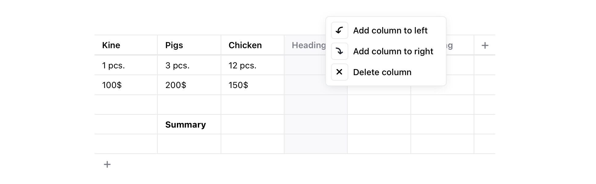

# Table tool

The Table Block for the [Editor.js](https://editorjs.io). Finally improved.



## Installation

Get the package

```shell
yarn add @editorjs/table
```

Include module at your application

```javascript
import Table from '@editorjs/table'
```

Optionally, you can load this tool from CDN [JsDelivr CDN](https://cdn.jsdelivr.net/npm/@editorjs/table@latest)


## Usage

Add a new Tool to the `tools` property of the Editor.js initial config.

```javascript
import Table from '@editorjs/table';

var editor = EditorJS({
  tools: {
    table: Table,
  }
});
```

Or init the Table tool with additional settings

```javascript
var editor = EditorJS({
  tools: {
    table: {
      class: Table,
      inlineToolbar: true,
      config: {
        rows: 2,
        cols: 3,
        maxRows: 5,
        maxCols: 5,
      },
    },
  },
});
```

## Config Params

| Field              | Type     | Description          |
| ------------------ | -------- | ---------------------------------------- |
| `rows`             | `number` | initial number of rows. `2` by default |
| `cols`             | `number` | initial number of columns. `2` by default |
| `maxRows`          | `number` | maximum number of rows. `5` by params |
| `maxCols`          | `number` | maximum number of columns. `5` by params |
| `withHeadings`     | `boolean` | toggle table headings. `false` by default |
| `stretched`        | `boolean` | whether the table is stretched to fill the full width of the container |

## Output data

This Tool returns `data` in the following format

| Field          | Type         | Description           |
| -------------- | ------------ | ----------------------------------------- |
| `withHeadings` | `boolean`    | Uses the first line as headings |
| `stretched`    | `boolean`    | whether the table is stretched to fill the full width of the container |
| `content`      | `string[][]` | two-dimensional array with table contents |

```json
{
  "type" : "table",
  "data" : {
    "withHeadings": true,
    "stretched": false,
    "content" : [ [ "Kine", "Pigs", "Chicken" ], [ "1 pcs", "3 pcs", "12 pcs" ], [ "100$", "200$", "150$" ] ]
  }
}
```

## CSP support

If you're using Content Security Policy (CSP) pass a `nonce` via [`<meta property="csp-nonce" content={{ nonce }} />`](https://github.com/marco-prontera/vite-plugin-css-injected-by-js#usestrictcsp-boolean) in your document head.

# Support maintenance 🎖

If you're using this tool and editor.js in your business, please consider supporting their maintenance and evolution.

[http://opencollective.com/editorjs](http://opencollective.com/editorjs)

# About CodeX


CodeX is a team of digital specialists around the world interested in building high-quality open source products on a global market. We are [open](https://codex.so/join) for young people who want to constantly improve their skills and grow professionally with experiments in leading technologies.

| 🌐 | Join  👋  | Twitter | Instagram |
| -- | -- | -- | -- |
| [codex.so](https://codex.so) | [codex.so/join](https://codex.so/join) |[@codex_team](http://twitter.com/codex_team) | [@codex_team](http://instagram.com/codex_team) |
